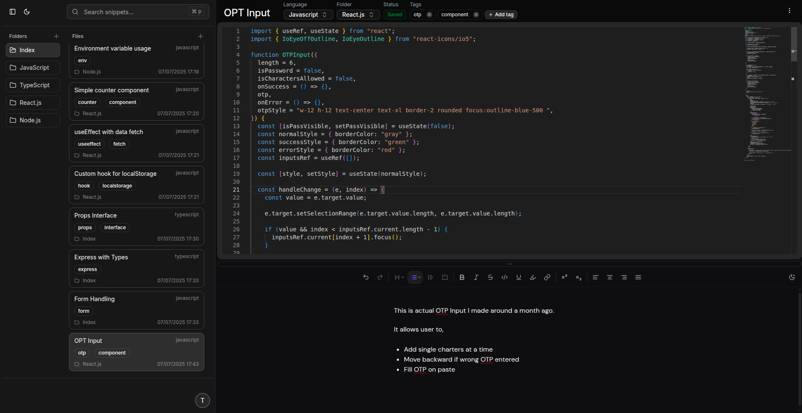

  

# 🧠 Snippet Manager - v1

A powerful, elegant, and desktop first web app to **create, organize, and manage reusable code snippets**.  
Built for developers tired of hunting through old projects, this tool keeps your frequently used logic, components, and utilities at your fingertips.

> 🚀 Live: [https://snippet-manager-gamma.vercel.app](https://snippet-manager-gamma.vercel.app)  
> ⚙️ Backend: [https://snippet-manager-qxtx.onrender.com](https://snippet-manager-qxtx.onrender.com)

---

## 🎯 Objective

Modern development often involves reusing similar functions, components, and logic — but keeping them organized across projects is painful.

**Snippet Manager** solves this by offering a minimal, blazing-fast snippet dashboard where you can:

- Organize snippets into folders
- Edit and preview code using a rich text/code editor
- Tag, search, and filter through your logic in seconds

---

## ✨ Features

- ⚡️ **Single-page design** for lightning-fast UX
- 🔐 **Authentication** via Clerk (custom UI + OTP support)
- 📁 **Folder & Snippet Structure**: Clean hierarchy to store related code blocks
- 🧠 **Rich Code Editor** with syntax highlighting (powered by **Monaco Editor**)
- 🗒️ **Rich Note Editor** with modern text blocks (powered by Tiptap + extensions)
- 🔎 **Search Snippets** by title (tag and folder search coming soon)
- ⌨️ **Keyboard Shortcuts**: CMD/CTRL+P to open the command menu, ESC to close dialogs, and more
- 🌙 **Dark/Light Mode** with theme toggle
- 🧪 **Polished Dialogs and Popups**: Custom modals for new snippets, folders, settings
- 🧱 **Reusable UI System** built using ShadCN + Tailwind

---

## 🛠 Tech Stack

**Frontend**

- React (TypeScript)
- Tailwind CSS
- ShadCN/UI
- Monaco Editor (for code support)
- Tiptap Editor (for note support)
- Zustand (for state management)

**Backend**

- Node.js + Express (TypeScript)
- MongoDB (Atlas)
- Clerk (for authentication)

**Deployment**

- Frontend: Vercel
- Backend: Render

---

## 💻 From the Developer

This isn't just a practice project — it's a real solution to a real developer pain: organizing and reusing code efficiently.

I built Snippet Manager to become a tool that _every developer_ can benefit from, and I'm actively improving it with real-world use in mind.

#### 💬 **Planned Features (V2 & Beyond)**

- 📄 Multi-page snippets
- 🔍 Full fuzzy search with tag and folder support
- 📱 Mobile support
- 🧩 VSCode Extension
- 🔗 Snippet sharing and collaboration
- 🤖 AI-powered code explanation + save as note
- 🔄 Snippet import/export
- Drag and Drop snippet across folder

#### 🐞 Known Issues / Improvements in Progress

- 🔍 Currently only searches by title (tag/folder search coming)
- 📱 Not yet optimized for mobile
- 🔐 Google/GitHub login + password reset flow planned
- 🛡️ Minimal form validation (being improved)
- ⚙️ API responses are being standardized
- 🧪 OTP flow polishing in progress

I'm actively polishing the app to improve usability.
